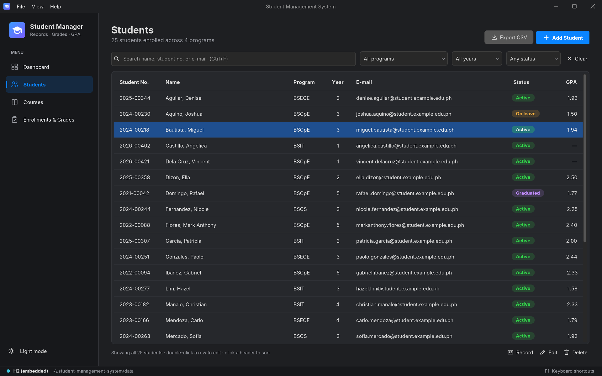
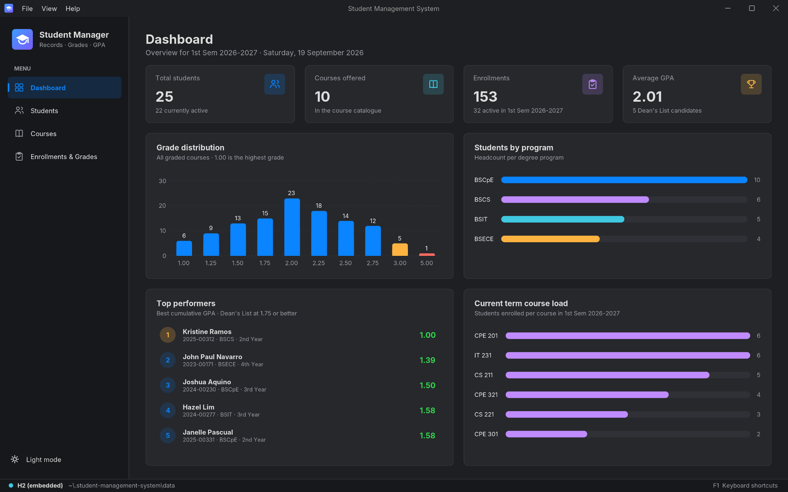
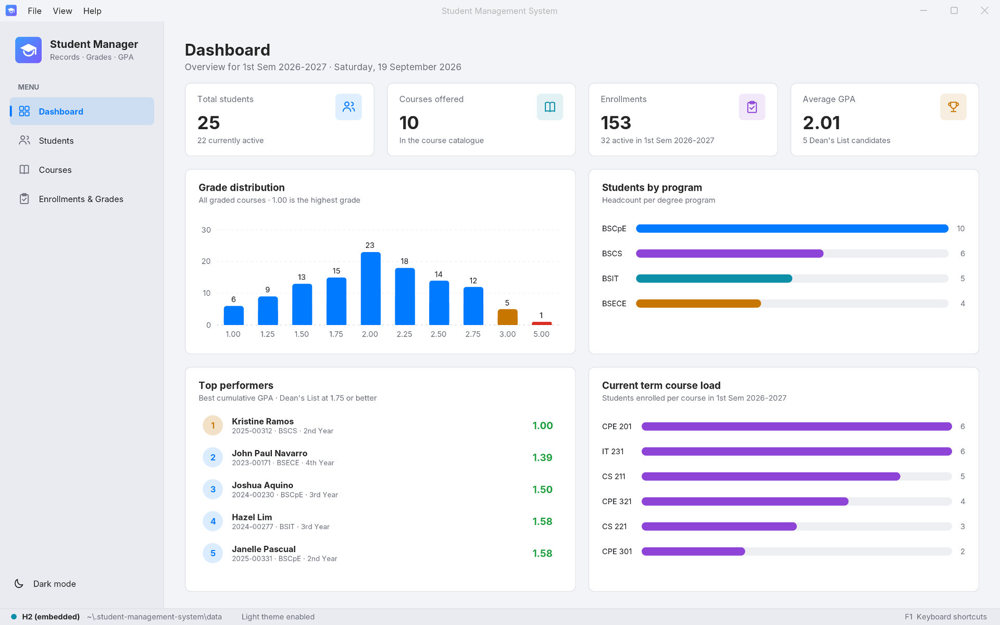
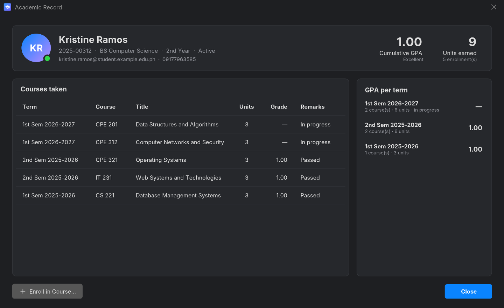
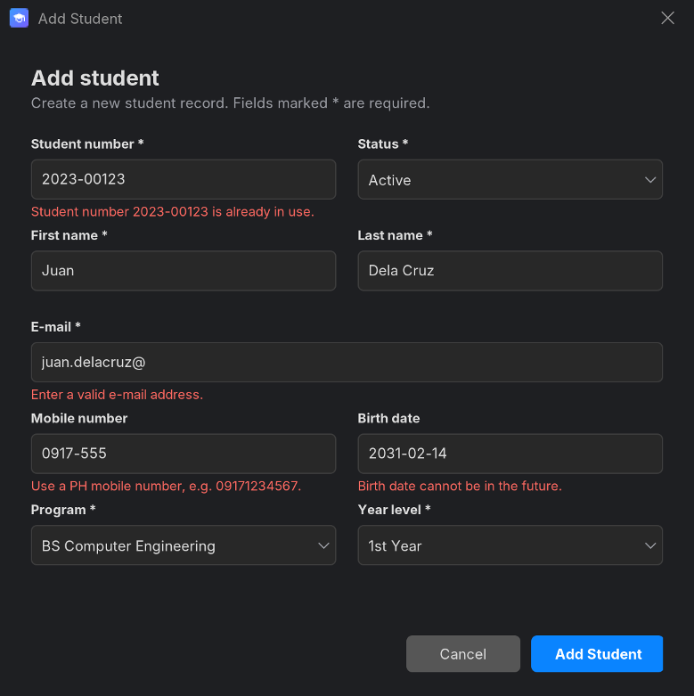
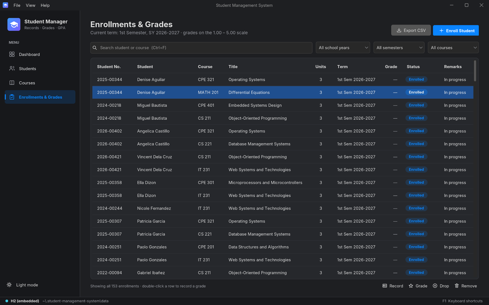
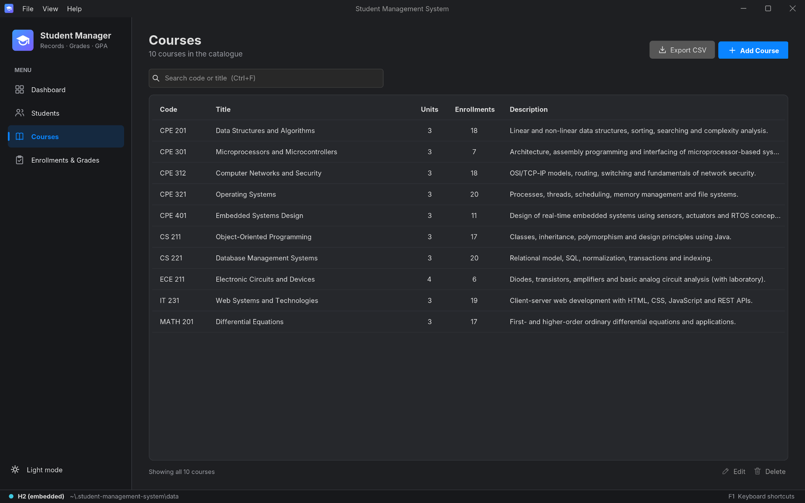
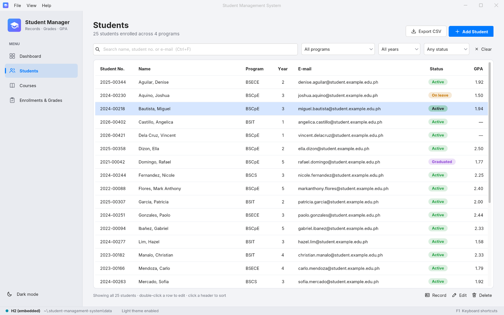
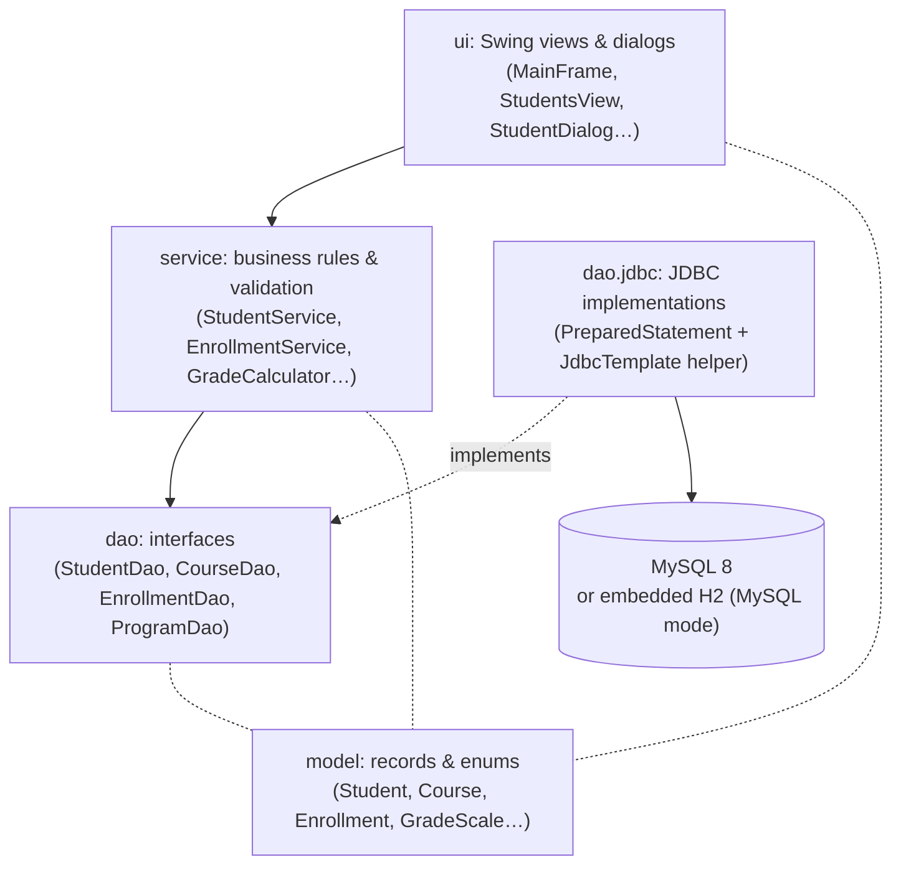
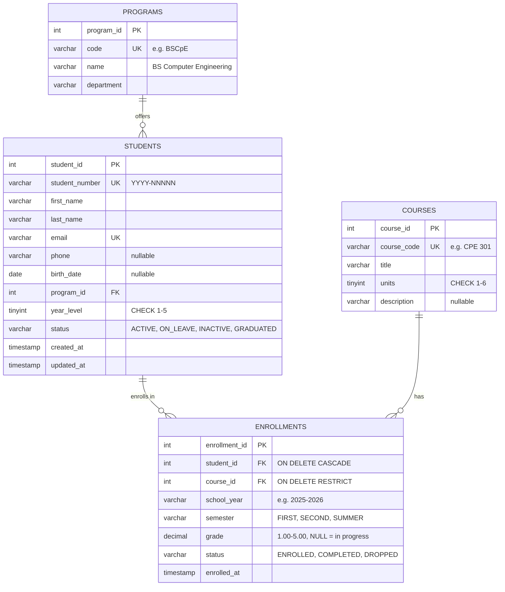

# Student Management System

A desktop application for managing a university's **student records, course catalogue, enrollments and grades**, built with **Java 17, Swing (FlatLaf) and JDBC** on a normalized **MySQL** schema. Search, filter and sort students, record grades on the Philippine 1.00–5.00 scale, and see each student's GPA computed from their transcript.

It runs against **MySQL** when one is configured, and falls back to an **embedded H2 database in MySQL-compatibility mode** (same schema, same SQL) when one isn't, so the app runs without any database setup.

[](https://github.com/PeterUngab34/student-management-system/actions/workflows/ci.yml)

**⬇ [Download the latest release](https://github.com/PeterUngab34/student-management-system/releases/latest)**: `StudentManagementSystem-windows-x64.zip` runs on Windows with **no Java installed** (unzip and double-click `Student Management System.exe`), and `student-management-system.jar` runs anywhere with Java 17+ (`java -jar student-management-system.jar`). Sample data is created on first launch.



<p align="center">
  
  
</p>
<p align="center">
  
  
</p>

<details>
<summary>More screenshots</summary>





</details>

## Features

- **Student records (CRUD):** add, edit and delete students. Every field is validated, and errors show next to the field they belong to: unique student number in `YYYY-NNNNN` format, unique e-mail, PH mobile number, realistic birth date, year level 1–5.
- **Search, filter & sort:** live search by name, student number or e-mail; filter by program, year level and status; click any column header to sort. Filtering runs in SQL with bound parameters.
- **Course catalogue:** CRUD for courses. A course that still has enrollment history can't be deleted.
- **Enrollments & grades:** enroll active students in a course for a school year and semester, record or change final grades, drop or remove enrollments. Enrolling the same student in the same course twice in one term is rejected.
- **GPA tracking:** unit-weighted cumulative GPA and GPA per term, units earned, pass/fail remarks, Dean's List candidates.
- **Dashboard:** totals, average GPA, grade distribution, headcount per program, top performers and current-term course load. The charts are drawn with Java2D; no charting library is used.
- **CSV export** of whatever the table currently shows (UTF-8 with BOM, so names like *Ibañez* open correctly in Excel).
- **Dark and light themes** with a live toggle (`Ctrl+T`). Your choice is remembered.
- **Keyboard shortcuts:** `Ctrl+1…4` switch pages, `Ctrl+N` add a record, `Ctrl+F` search, `Enter` edit, `Delete` delete, `Ctrl+E` export, `F5` refresh, `F1` list all shortcuts. The menus also have mnemonics.
- The status bar shows which database is active (**MySQL** or **H2**) and why it fell back to H2 if MySQL couldn't be reached.

## Tech stack

| Area | Technology |
|---|---|
| Language | Java 17 (records, switch expressions, text blocks) |
| UI | Swing, [FlatLaf](https://www.formdev.com/flatlaf/) (macOS-style light/dark themes), Inter font, MigLayout |
| Data access | Plain JDBC: `PreparedStatement` for every query, no ORM |
| Database | MySQL 8 (Connector/J), with H2 2.x in MySQL mode as the embedded fallback |
| SQL | Normalized schema: foreign keys, `UNIQUE` and `CHECK` constraints, indexes |
| Build | Maven (wrapper included). The Shade plugin builds a single runnable jar; `jpackage` + `jlink` produce the self-contained Windows build |
| Tests | JUnit 5 (92 tests) against in-memory H2 using the real schema and seed scripts, including in-process Swing UI tests |

## Architecture

The code is split into layers, and each layer only talks to the one below it:



- **`model`**: immutable records (`Student`, `Course`, `Enrollment`, `Program`), enums and the `GradeScale` rules.
- **`dao`**: data-access interfaces. `dao.jdbc` implements them with `PreparedStatement` everywhere; dynamic `ORDER BY` columns come from a whitelisted enum, never from user input.
- **`service`**: validation and business rules (uniqueness, formats, only active students may enroll, no duplicate enrollment, dropped courses can't be graded, courses with history can't be deleted) plus GPA computation. Errors come back as a `ValidationException` that carries a message per field.
- **`db`**: configuration, the MySQL → H2 fallback, and a small SQL script runner that creates the schema and sample data on first run.
- **`ui`**: Swing views and dialogs; `AppContext` wires everything together (manual dependency injection).

```
src/main/java/com/peterungab/sms
├── App.java, AppContext.java      entry point (+ --smoke-test) and composition root
├── model/                          Student, Course, Enrollment, Program, GradeScale, filters, enums
├── dao/                            DAO interfaces + DataAccessException
│   └── jdbc/                       JDBC implementations + JdbcTemplate helper
├── service/                        StudentService, CourseService, EnrollmentService, DashboardService, GradeCalculator
├── db/                             DatabaseConfig, Database (MySQL/H2), DatabaseInitializer, SqlScriptRunner
├── ui/                             MainFrame, Sidebar, StatusBar, Theme, Icons
│   ├── views/                      Dashboard, Students, Courses, Enrollments pages
│   ├── dialogs/                    add/edit forms, grade entry, academic record
│   └── components/                 Card, StatCard, BarChart, PillRenderer…
├── util/CsvWriter.java
└── tools/ScreenshotTool.java       renders the README screenshots offscreen
sql/schema.sql, sql/seed.sql        the database (used by MySQL and bundled for H2)
```

## Database design



- `enrollments` is the many-to-many link between students and courses. `UNIQUE (student_id, course_id, school_year, semester)` stops duplicate enrollments at the database level, and the service layer checks the same rule first so it can show a friendly message.
- `CHECK` constraints enforce the grading rules in the database as well: a grade must be between 1.00 and 5.00, and a `COMPLETED` enrollment must have a grade (other statuses must not).
- Deleting a student cascades to their enrollments. A course with enrollments can't be deleted (`RESTRICT`).
- Indexes cover name search (`last_name, first_name`), the list filters (`program_id, year_level, status`) and the enrollment lookups (`course_id`, and `school_year, semester`).
- The seed data avoids hard-coded surrogate keys. Foreign keys are looked up with subqueries on the natural keys (student number, course code), so the same script runs on MySQL and H2.

**Grading scale (Philippine system):** 1.00 (excellent) · 1.25–1.50 · 1.75–2.25 · 2.50–2.75 · 3.00 (lowest passing) · 5.00 (failed). **GPA = Σ(grade × units) / Σ(units)** over completed courses, rounded half-up to two decimals. Lower is better.

## Getting started

### Run on Windows (no Java required)

1. Download **`StudentManagementSystem-windows-x64.zip`** from the [latest release](https://github.com/PeterUngab34/student-management-system/releases/latest).
2. Extract the zip anywhere (right-click → *Extract All…*).
3. Open the extracted `Student Management System` folder and run **`Student Management System.exe`**.

The zip contains its own trimmed Java runtime, so nothing needs to be installed. Because the build isn't code-signed, Windows SmartScreen may show *"Windows protected your PC"* the first time: click **More info → Run anyway**. The app starts on the embedded database with sample data and keeps its data in `%USERPROFILE%\.student-management-system`.

Everything below is for macOS/Linux, for running the `.jar` with your own Java, or for building from source.

**Requirements:** JDK 17 or newer. Maven isn't required because the Maven wrapper (`mvnw`) is included.

### 1. Build

```bash
# Windows
mvnw.cmd package
# macOS / Linux
./mvnw package
```

This compiles the code, runs the tests and produces **`target/student-management-system.jar`**, a single jar that includes all dependencies.

### 2. Run with zero setup (embedded H2)

```bash
java -jar target/student-management-system.jar
```

On first launch the app creates `~/.student-management-system/data/sms.mv.db` from `sql/schema.sql` and `sql/seed.sql` (25 students, 10 courses and 153 enrollments with grades). The status bar shows **H2 (embedded)**.

### 3. Run on MySQL

1. Create the database and a user (MySQL 8.0.16+):
   ```sql
   CREATE DATABASE student_management CHARACTER SET utf8mb4;
   CREATE USER 'sms_app'@'localhost' IDENTIFIED BY 'change-me';
   GRANT ALL PRIVILEGES ON student_management.* TO 'sms_app'@'localhost';
   ```
2. Load the schema and sample data. You can skip this step: on first connect, the app creates the tables and sample data if they are missing.
   ```bash
   mysql -u sms_app -p --default-character-set=utf8mb4 student_management < sql/schema.sql
   mysql -u sms_app -p --default-character-set=utf8mb4 student_management < sql/seed.sql
   ```
3. Copy `db.properties.example` to `db.properties` (in the folder you run the jar from, or in `~/.student-management-system/`) and fill in your details:
   ```properties
   db.url=jdbc:mysql://localhost:3306/student_management?useSSL=false&allowPublicKeyRetrieval=true&serverTimezone=Asia/Manila&connectTimeout=5000
   db.user=sms_app
   db.password=change-me
   ```
   You can use the environment variables `SMS_DB_URL`, `SMS_DB_USER` and `SMS_DB_PASSWORD` instead.
4. Start the jar. The status bar now shows **MySQL**. If the server can't be reached, the app says so and continues on H2.

### Other commands

```bash
./mvnw test                                                   # run the test suite
java -jar target/student-management-system.jar --smoke-test   # non-interactive check: init DB, build + paint every page & dialog in both themes, exit 0/1
java -cp target/student-management-system.jar com.peterungab.sms.tools.ScreenshotTool docs   # regenerate the screenshots
```

### Building the Windows package

`scripts\package-windows.cmd` produces the no-Java-required build that is attached to releases. It needs a JDK 17+ that ships `jpackage` (`JAVA_HOME` or on `PATH`) and does the following:

1. `mvnw.cmd clean package -DskipTests` builds the fat jar.
2. `IconTool` renders the app mark into a multi-resolution `.ico` (16–256 px, each size drawn from the vector artwork).
3. `jdeps --print-module-deps` works out which JDK modules the jar needs; `java.desktop`, `java.sql`, `java.naming`, `java.logging`, `java.management` and `jdk.unsupported` are added because H2, FlatLaf and the JDBC drivers reach them reflectively.
4. `jpackage --type app-image` bundles the jar with a `jlink`ed runtime of just those modules into `target\dist\Student Management System\`.
5. The folder is zipped to `target\StudentManagementSystem-windows-x64.zip`.

`"target\dist\Student Management System\Student Management System.exe" --smoke-test` runs the same self-check as the jar and exits 0 when every page and dialog renders. The app image is not code-signed, hence the SmartScreen prompt on first launch.

## Tests

`./mvnw test` runs **92 JUnit 5 tests** against in-memory H2 databases in MySQL mode, built from the real `schema.sql` and `seed.sql`:

- **Schema:** seed counts, `CHECK`/`UNIQUE`/foreign-key constraints, cascade on delete, and idempotent initialization.
- **DAOs:** insert/update/delete round trips, lookups by natural key, combined filters with sorting, aggregates, and the enrollment lifecycle.
- **StudentService:** CRUD, duplicate student number and e-mail rejection, per-field validation, Filipino names (ñ, hyphens), search by name, number or e-mail, filters, sorting, and LIKE wildcards and injection payloads treated as literal text.
- **CourseService:** code normalization (`cpe301` → `CPE 301`), validation, and refusing to delete a course that has enrollments.
- **EnrollmentService:** duplicate enrollment rejection, retakes in a later term, only active students can enroll, grade-scale validation, drop rules, and unit-weighted GPA and per-term GPA checked against hand-computed values.
- **GradeCalculator, CsvWriter, DatabaseConfig:** GPA rounding, CSV escaping and BOM, config precedence, and the MySQL → H2 fallback when the server is unreachable.
- **UI (in-process Swing):** the real `MainFrame` and dialogs against a seeded database, driven through the components' own listeners rather than OS input. Adding a student through the dialog (row appears, database row normalized), per-field validation messages, editing via double-click, deleting via the Delete key with the confirmation answered by a test seam, live search with its debounce, program/year/status filters, sorting by clicking a column header, CSV export through a stand-in file chooser (BOM, header, row order, "replace file?" prompt), enrolling from the academic record, recording a grade and seeing the GPA change, drop/remove, the sidebar/menu/shortcut navigation, window geometry and icon, and the live theme toggle with its persisted preference. Modal prompts go through `ui.Prompts`, whose handler the tests replace, so no dialog ever blocks. These tests need a display and are skipped on headless CI runners.
- **IconTool:** the generated `.ico` has one natively rendered, transparent PNG entry per size.

## Author

**Peter Paul Ungab**, Computer Engineering student, Philippines

- GitHub: [@PeterUngab34](https://github.com/PeterUngab34)
- Email: [peterpaulungab00@gmail.com](mailto:peterpaulungab00@gmail.com)
