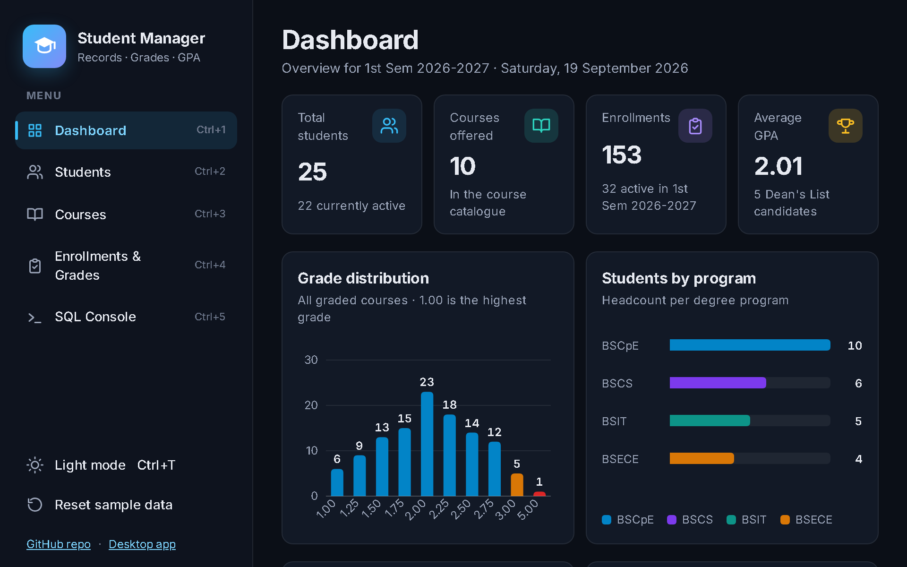

# Student Management System — web edition

A browser version of the desktop app that runs the **same SQL schema and sample data on SQLite, inside your browser**, with no server: [sql.js](https://github.com/sql-js/sql.js) (SQLite compiled to WebAssembly, MIT) executes `sql/schema.sql` and `sql/seed.sql`, and the pages talk to that database exactly like the Java services talk to MySQL/H2.

**Live demo:** <https://peterungab34.github.io/student-management-system/>



## What it does

Feature parity with the Swing desktop app, with the same business rules and error messages:

| Page | Features |
|---|---|
| **Dashboard** | Totals, average GPA, Dean's List count, grade distribution and headcount-per-program charts (inline SVG), top performers (click to open the record), current-term course load |
| **Students** | Live search on name / student no. / e-mail, program / year / status filters, sortable columns, add & edit dialogs with the `StudentService` validation rules (unique `YYYY-NNNNN` number, unique e-mail, PH mobile, birth date, year level 1–5), delete with confirmation (cascades to enrollments), academic record with per-term and cumulative unit-weighted GPA, CSV export (UTF-8 BOM, CRLF) |
| **Courses** | CRUD with code normalization (`cpe301` → `CPE 301`); deleting a course with enrollment history is refused |
| **Enrollments & Grades** | Enroll active students per school year / semester (duplicates rejected), record or clear a grade on the 1.00–5.00 scale, drop, remove |
| **SQL Console** | Run read-only `SELECT` / `WITH` queries against the live database, with example queries (joins, `GROUP BY` GPA per program, CTEs), a results table and SQLite's error messages |

Dark theme by default with a light toggle (`Ctrl+T`), left sidebar (a drawer on phones), status bar showing the storage mode, keyboard shortcuts (`?` lists them), `<dialog>`-based modals, keyboard-navigable tables.

## How it works

```
web/
├── index.html            shell (sidebar, banner, status bar)
├── css/app.css           theme tokens (dark/light), layout, components
├── js/
│   ├── app.js            boot: load sql.js, restore/create the DB, routing, theme, shortcuts
│   ├── db.js             thin wrapper over sql.js (bound parameters, rows as objects, read-only console mode)
│   ├── storage.js        persists the SQLite file bytes in IndexedDB (localStorage fallback)
│   ├── domain/           the service layer, ported 1:1 from src/main/java/.../service
│   │   ├── students.js   StudentService: normalization, validation, uniqueness, search/filter/sort SQL
│   │   ├── courses.js    CourseService: code normalization, validation, delete-with-history rule
│   │   ├── enrollments.js EnrollmentService: enroll/grade/drop rules, academic record, current term
│   │   ├── grades.js     GradeScale + GradeCalculator (exact hundredths, HALF_UP rounding)
│   │   ├── dashboard.js  DashboardService aggregates
│   │   └── csv.js        CsvWriter
│   └── ui/               pages, dialogs, sortable table, SVG charts
├── sql/
│   ├── schema.sqlite.sql translated from ../sql/schema.sql (differences listed in its header)
│   └── seed.sqlite.sql   GENERATED from ../sql/seed.sql by scripts/sync-seed.mjs
├── vendor/sqljs/         sql.js 1.14.2 (sql-wasm.js + sql-wasm.wasm + LICENSE)
├── scripts/sync-seed.mjs regenerates sql/seed.sqlite.sql; --check fails when it is stale
└── tests/                node:test unit tests + tests/e2e/run.mjs (headless Chrome)
```

On first load the app runs `sql/schema.sqlite.sql` and then the seed, which yields exactly **4 programs, 25 students, 10 courses and 153 enrollments** (the seed's foreign keys are resolved through subqueries on natural keys, just as on MySQL/H2). After every write the database file is exported and saved to IndexedDB, so edits survive reloads; **Reset sample data** in the sidebar discards them. GPA arithmetic is done in integer hundredths with half-up rounding so it matches the `BigDecimal` math in Java to the cent.

### Seed fidelity

`sql/seed.sql` at the repository root is the single source of truth. `web/sql/seed.sqlite.sql` is generated from it by `node web/scripts/sync-seed.mjs` (a small MySQL → SQLite transform that strips backticks, `USE`/`SET` statements, `INSERT IGNORE`, `ENGINE=`). The test `tests/seed-sync.test.mjs` fails if the generated file is out of date, and the Pages workflow regenerates it before building the site.

### Schema differences (MySQL → SQLite)

Listed in full in the header of `sql/schema.sqlite.sql`: `AUTO_INCREMENT` → `INTEGER PRIMARY KEY AUTOINCREMENT`, `TINYINT` → `INTEGER`, `DECIMAL(3,2)` → `NUMERIC(3,2)`, `VARCHAR(n)` lengths not enforced by SQLite (the service layer enforces them), dates/timestamps stored as ISO-8601 text, and `PRAGMA foreign_keys = ON` being required per connection. All constraints (`UNIQUE`, `FOREIGN KEY … ON DELETE CASCADE/RESTRICT`, every `CHECK`) and indexes keep their names and semantics.

## Run locally

Any static file server works (the page needs HTTP because of WebAssembly and `fetch`; opening `index.html` from disk will not):

```bash
cd web
npx serve .            # then open the printed URL
# or: python -m http.server 8080
```

The site uses only relative URLs, so it also works under a sub-path such as `/student-management-system/` (which is how GitHub Pages serves it).

## Tests

```bash
cd web
npm ci                 # installs sql.js for Node (the only dependency, dev-only)
npm test               # 38 node:test unit tests
npm run check-seed     # is web/sql/seed.sqlite.sql in sync with sql/seed.sql?
npm run e2e            # headless Chrome end-to-end run (needs Chrome; set CHROME=<path> if not found)
```

Unit tests cover: schema + seed row counts and constraints (CHECK, UNIQUE, FK cascade/restrict), GPA math against the same hand-computed figures as the Java tests (1.675 → 1.68, half-up rounding, failed courses count toward GPA but not units earned), every `StudentService` / `CourseService` / `EnrollmentService` validation message, duplicate-enrollment rejection, course-delete-with-history, CSV escaping, the read-only SQL console, and the seed sync. The E2E run serves the repository so `/student-management-system/` maps to `web/`, then checks page load with zero console errors, counts, search/filter/sort, add-student validation and success, enroll → grade → GPA in the record view, CSV content, the SQL console, persistence across reload, reset, the theme toggle and the 375 px layout (no horizontal overflow, drawer opens and closes with Escape).

## Deployment

`.github/workflows/pages.yml` runs on pushes to `main` that touch `web/**`, `sql/**` or the workflow: it installs the test dependency, regenerates the seed, runs the unit tests, copies `web/` (without tests/tooling) into the artifact and deploys it with `actions/deploy-pages`.

## Limitations

- Data lives only in the browser that created it (IndexedDB); there is no sync or multi-user access. Clearing site data removes it.
- The SQL console is read-only by design (`PRAGMA query_only` plus a statement check); use the pages to change data.
- SQLite is not MySQL: `VARCHAR` lengths are not enforced at the database level (the service layer enforces them), and timestamps default to UTC.
- The current term is derived from the browser's clock, so the "current term" figures shift with the date, exactly as in the desktop app.
- Inter is loaded from Google Fonts; offline the page falls back to the system font.
